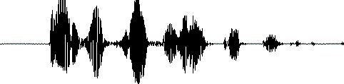
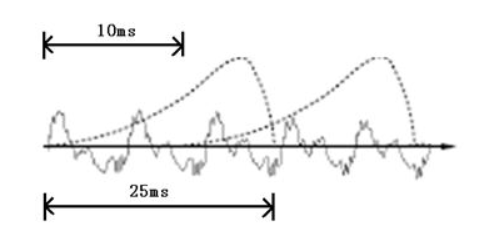
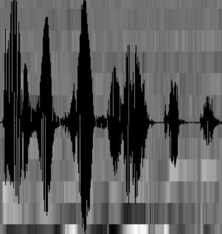
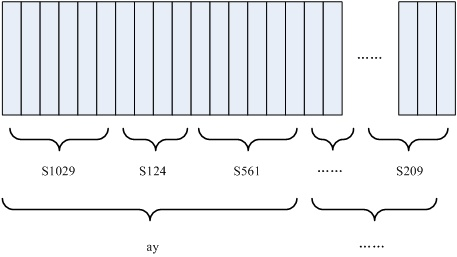
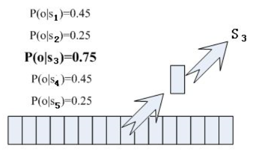
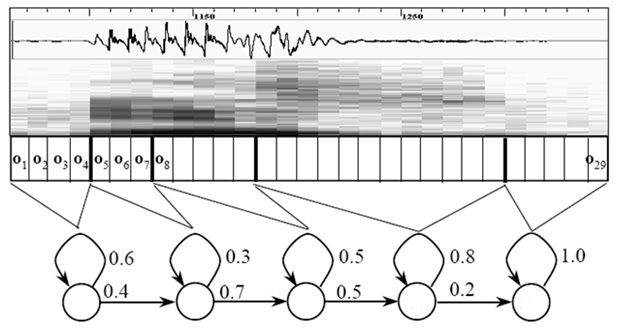

# 语音识别步骤

## 1.压缩文件转非压缩纯波形文件
常见的 mp3等格式都是压缩格式,必须转成非压缩的纯波形文件来处理,比如 Windows PCM文件,也就是俗称的wav文件。wav文件里存储的除了一个文件头以外,就是声音波形的一个个点了。下图是一个波形的示例。

## 2.VAD操作(静音切除)
在开始语音识别之前, 有时需要把首尾端的静音切除, 降低对后续步骤造成 的干扰。这个静音切除的操作一般称为 VAD ,需要用到信号处理的一些技术。
## 3.对声音分帧
要对声音进行分析, 需要对声音分帧, 也就是把声音切开成一小段一小段, 每小段称为一帧。 分帧操作一般不是简单的切开, 而是使用移动窗函数来实现, 这里不详述。帧与帧之间一般是有交叠的,就像下图这样:
<br>
图中,每帧的长度为 25毫秒,每两帧之间有 25-10=15毫秒的交叠。我们称为以帧长25ms 、帧移10ms分帧。分帧后,语音就变成了很多小段。但波形在时域上几乎没有描述能力, 因此必须将波形作变换。
## 4.对波形做变换
常见的一种变换方法是提取MFCC特征,根据人耳的生理特性,把每一帧波形变成一个多维向量,可以简单地理解为这个向量包含了这帧语音的内容信息。这个过程叫做声学特征提取。实际应用中,这一步有很多细节,声学特征也不止有MFCC这一种,具体 这里不讲。至此,声音就成了一个 12行 (假设声学特征是12维) N 列的一个矩 阵,称之为观察序列,这里N为总帧数。观察序列如下图所示,图中,每一帧都用一个12维的向量表示,色块的颜色深浅表示向量值的大小。<br>

## 5.将帧识别为状态
两个概念：<br>
* 音素：单词的发音由音素构成。英语音素集采用卡内基梅隆大学的一套39个音素构成的集合。汉语采用声母和韵母作为音素集。<br>
* 状态：比音素更为细致的语音单元。通常把一个音素划分为3个状态。<br>

如下图所示：<br>

<br>图中, 每个小竖条代表一帧,若干帧语音对应一个状态, 每三个状态组合成一个音素,若干个音素组合成一个单词。也就是说,只要知道每帧语音对应哪个状态了,语音识别的结果也就出来了。
要确定每帧音素对应的状态，就要看帧对应哪个状态的概率最大那么帧就属于哪个状态。比如下图，该帧在状态S3的概率最大，所以属于S3<br>
<br>
图中用到的概率，从“声学模型”中提取。声学模型中存了许多参数，通过参数得知帧和状态对应的概率。可以通过使用大量的语音数据进行分析训练，获取模型参数。
## 6.状态组合为音素
使用HMM(隐马尔可夫模型)，解决相邻帧状态差异问题。HMM可以构建一个状态网络，并从状态网络中寻找与声音最匹配的路径。这样，结果被限制在预先设定的网络中。这个网络需要足够大，要包含任意文本的路径。但不能过大，会造成识别准确率降低。所以要选择大小适当的网络。
## 7.音素组合成单词
在状态网络中搜索最佳路径，语音对应这条路径的概率最大，称为“解码”。采用Viterbi(动态规划剪枝)算法，寻找全局最优路径。
<br>
图中的累计概率由三部分组成：<br>
* 观察概率：每帧和每个状态对应的概率<br>
* 转移概率：每个状态到自身或者转移到下个状态的概率<br>
* 语言概率：根据语言统计规律得到的概率<br>

前两种概率从声学模型中获取，语言概率从语言模型中获取。语言模型通过大量文本训练得到，可利用某种语言本身的规律提升识别的准确率。
```